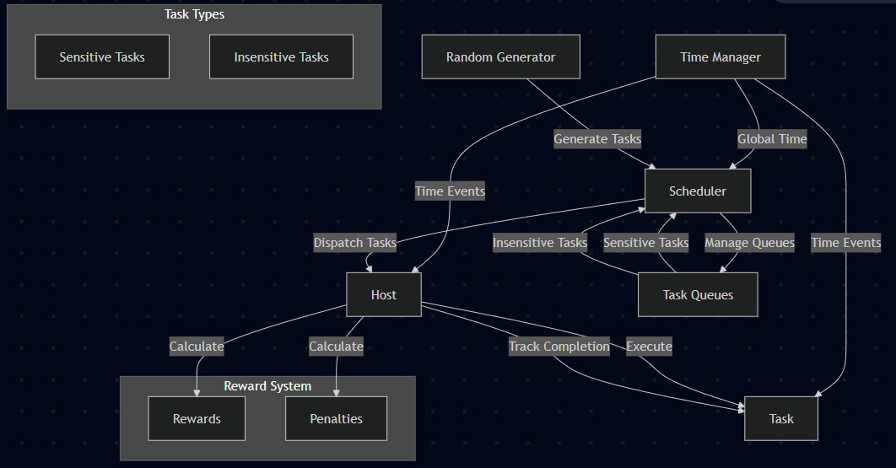
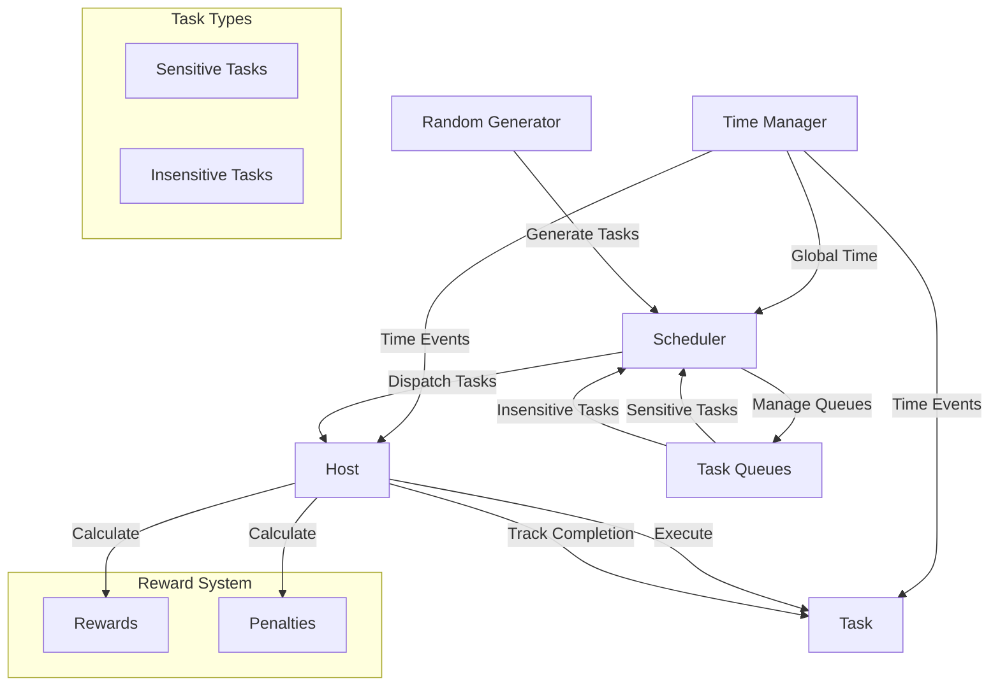

# Simulation Module

## Technical Overview

The simulation module implements a distributed task scheduling system with deadline-aware task execution and reward-based performance metrics.

## Component Diagram





## Component Roles

### Time Manager (`time.ts`)

- Central time synchronization component
- Maintains global simulation time
- Notifies components of time changes
- Used for task scheduling and deadline tracking

### Scheduler (`scheduler.ts`)

- Core orchestration component
- Manages task queues (sensitive and insensitive)
- Distributes tasks to available hosts
- Implements scheduling algorithms
- Tracks system-wide performance metrics

### Host (`host.ts`)

- Task execution component
- Manages resource allocation
- Tracks task completion
- Calculates rewards and penalties
- Handles deadline violations

### Task (`task.ts`)

- Represents computational work
- Contains execution requirements
- Tracks lifecycle timestamps
- Manages deadline constraints

### Task Queues

- Separate queues for sensitive and insensitive tasks
- Prioritizes deadline-sensitive tasks
- Managed by the scheduler

### Random Generator

- Creates task variations
- Determines task arrival patterns
- Generates resource requirements

### Reward System

- Tracks performance metrics
- Calculates rewards for successful completions
- Applies penalties for deadline violations

## Core Components

### Time Management (`time.ts`)

```typescript
export class Time {
  private _value: number = 0;
  private listeners: ((newValue: number) => void)[] = [];
}
```

- Implements observer pattern for time-based events
- Used by `Host` for task completion tracking
- Referenced in `index.ts` as `GLOBAL_TIME`

### Task System (`task.ts`)

```typescript
export class Task extends BaseTask {
  deadlineTime!: number;
  startTime?: number;
  completeTime?: number;
}
```

- Extends `BaseTask` from `../cluster/task`
- Tracks task lifecycle timestamps
- Used by `Host` for execution and `Scheduler` for queue management

### Host Implementation (`host.ts`)

```typescript
export class Host extends BaseHost {
  currentTask: undefined | Task;
  taskReceivedTime: undefined | number;
  taskCompleteTime!: number;
  reward!: number;
  penalty!: number;
}
```

- Extends `BaseHost` from `../cluster/host`
- Implements task execution logic
- Integrates with `REWARDS` from `../types/taskTypes`
- Uses `GLOBAL_TIME` for task completion tracking

### Scheduler (`scheduler.ts`)

```typescript
export class Scheduler extends BaseScheduler {
  hosts!: Host[]
  queueSensitive!: Task[];
  queueInsensitive!: Task[];
}
```

- Extends `BaseScheduler` from `../cluster/scheduler`
- Manages task queues and host allocation
- Implements reward/penalty calculation

## Simulation Configuration (`index.ts`)

```typescript
const TIME_SLOT = 10; // ms
const MAX_TIME = 50; // ms
const HOSTS = [
  new Host('1', 16_777_216, 10_000, 3_500_000_000, 1),
  new Host('2', 16_777_216, 10_000, 3_500_000_000, 2)
];
```

## Dependencies

- `random`: Task generation and randomization
- `../cluster/*`: Base classes
- `../types/taskTypes`: Task type definitions and reward configurations

## Technical Implementation Details

### Task Execution Flow

1. Task generation in `index.ts`:

   ```typescript
   function generateRandomTask() {
     const type = random.choice(Object.values(TASK_TYPES));
     return new Task(
       lastTaskId.toString(), type.taskType, GLOBAL_TIME.value,
       type.value, type.cpu, type.mem, type.net, type.dist,
       type.sensitive, type.isSoftDeadline, type.deadlineT);
   }
   ```

2. Host task execution in `host.ts`:

   ```typescript
   execute(task: Task) {
     this.currentTask = task;
     this.taskReceivedTime = GLOBAL_TIME.value;
     const expectedCpuUsage = task.distribution();
     const expectedExecutionT = (expectedCpuUsage / this.cpu) * 1000;
     this.taskCompleteTime = GLOBAL_TIME.value + this.transmissionDelay + expectedExecutionT;
   }
   ```

3. Task completion checking in `host.ts`:

   ```typescript
   checkCompleted() {
     if (GLOBAL_TIME.value >= this.taskCompleteTime) {
       // Handle task completion and rewards
     } else if (task.sensitive && !task.isSoftDeadline && GLOBAL_TIME.value >= task.deadlineTime) {
       // Handle deadline violation
     }
   }
   ```

### Scheduling Algorithm

```typescript
dispatch() {
  let freeHosts = this.hosts.filter(h => !h.currentTask);
  while (freeHosts.length > 0) {
    let task = this.selectTask();
    let host = freeHosts.shift();
    if (!task || !host) break;
    host.execute(task);
    task.startTime = GLOBAL_TIME.value;
  }
}
```

## Performance Metrics

- Task completion time tracking
- Deadline violation detection
- Reward/penalty accumulation
- Host utilization monitoring

## Technical Constraints

- Time slot: 10ms
- Maximum simulation time: 50ms
- Host resources:
  - Memory: 16,777,216 units
  - Network: 10,000 units
  - CPU: 3,500,000,000 units
  - Transmission delay: 1-2 units 